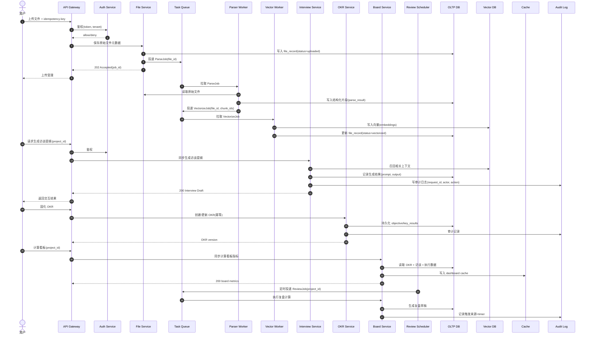

# PMCopilot MVP 架构补充说明

## 1) 系统时序图

---

## 2) 任务类型定义

### A. 同步请求（交互生成）
- **典型场景**：访谈提纲生成、即时看板查询、OKR 单条固化。
- **SLA 目标**：P95 < 3s（查询/生成），P95 < 1s（纯查询）。
- **执行约束**：
  - 必须走 API Gateway + 鉴权；
  - 需要幂等键保护写请求；
  - 超时后返回可追踪 request_id。

### B. 异步任务（批量拟合、定时复盘）
- **典型场景**：文件解析、向量化、历史数据批量拟合、定时复盘任务。
- **SLA 目标**：最终一致性（分钟级），可重试并可追踪。
- **执行约束**：
  - 使用队列削峰；
  - worker 无状态、可水平扩展；
  - 失败进入重试队列和死信队列（DLQ）。

---

## 3) 数据刷新策略

| 数据域 | 刷新间隔 | 缓存 TTL | 失效触发 | 失败重试策略 |
|---|---:|---:|---|---|
| 看板关键指标（项目级） | 5 分钟 | 300s | OKR 更新、访谈新结论、任务状态变更 | 指数退避（1m/2m/5m），最多 5 次 |
| 访谈生成上下文快照 | 按请求实时 | 120s | 文档向量更新 | 即时重试 1 次 + 延迟队列 2 次 |
| OKR 聚合统计 | 10 分钟 | 600s | OKR 新版本发布 | 固定间隔重试（2m），最多 3 次 |
| 复盘报告草稿 | 每日定时（如 02:00） | 24h | 人工触发复盘 | 指数退避（5m/15m/30m），失败入 DLQ |

**补充原则**：
1. 读优先走缓存，写路径强一致落库后异步刷新缓存；
2. 缓存键包含 `tenant_id + project_id + version`，避免串数据；
3. 重试必须携带同一幂等键，防止重复副作用。

---

## 4) API 边界与鉴权

### 模块级路由
- `/api/v1/files/*`：上传、状态查询、解析任务。
- `/api/v1/interviews/*`：访谈提纲生成与历史记录。
- `/api/v1/okrs/*`：OKR 创建、更新、版本管理。
- `/api/v1/board/*`：看板指标查询与刷新。
- `/api/v1/reviews/*`：复盘任务触发与结果查询。
- `/api/v1/admin/*`：系统配置、队列管理（管理员）。

### 鉴权与多租户
- 统一 JWT/OIDC 鉴权；
- token 必含：`sub`、`tenant_id`、`roles`、`scope`；
- 网关执行 RBAC，服务内执行资源级 ABAC（project ownership）。

### 请求幂等键
- 对所有写接口要求 Header：`Idempotency-Key`；
- 组合唯一键建议：`tenant_id + route + idempotency_key`；
- 幂等记录保存 24h，命中时返回首次响应快照。

### 审计日志字段（最小集合）
- `request_id`
- `trace_id`
- `timestamp`
- `actor_id`
- `tenant_id`
- `module`
- `action`
- `resource_type`
- `resource_id`
- `result`（success/fail）
- `error_code`
- `ip`
- `user_agent`

---

## 5) MVP 技术切片与验收标准

### MVP 优先实现的核心路径（建议 3 条）
1. **上传→解析→向量化闭环**
   - 完成从文件入库到可检索上下文的最短路径；
2. **访谈提纲同步生成**
   - 基于向量召回完成一轮“可交互”价值展示；
3. **OKR 固化 + 看板关键指标**
   - 支持 OKR 写入、指标聚合、可视化查询。

> 定时复盘先做“手动触发 + 异步执行”，待核心链路稳定后再上 cron 自动化。

### 验收标准（DoD）

#### A. 功能验收
- 文件上传后 **10 分钟内** 可用于访谈上下文召回；
- 访谈提纲接口成功率 ≥ 99%，且支持 request_id 追踪；
- OKR 写入具备幂等语义（重复请求不产生重复记录）；
- 看板接口返回关键指标：目标进度、风险项、最近复盘时间。

#### B. 非功能验收
- 鉴权覆盖率 100%（所有 `/api/v1/*`）；
- 审计日志覆盖所有写操作与异步任务状态变更；
- 队列任务失败可重试，可在 DLQ 中定位与重放；
- 关键接口具备基础压测报告（QPS、P95、错误率）。

#### C. 运行验收
- 提供最小可观测性：metrics + structured logs + trace_id；
- 线上配置可独立调整：TTL、重试次数、调度周期；
- 回滚策略明确：关闭异步消费者后系统仍可读写核心数据。
